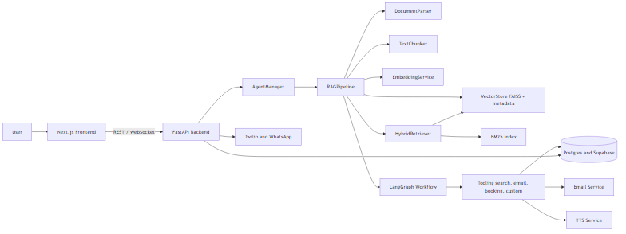
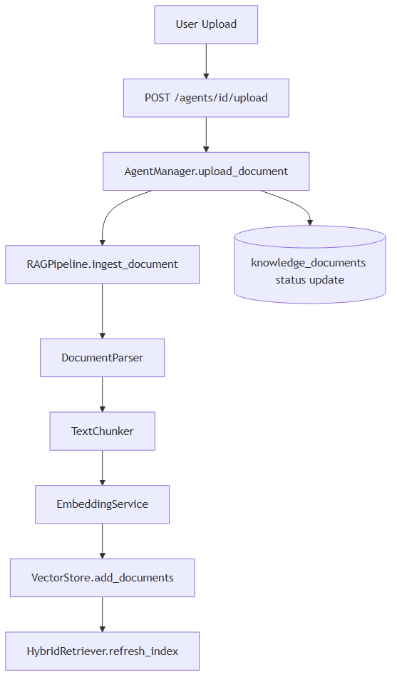
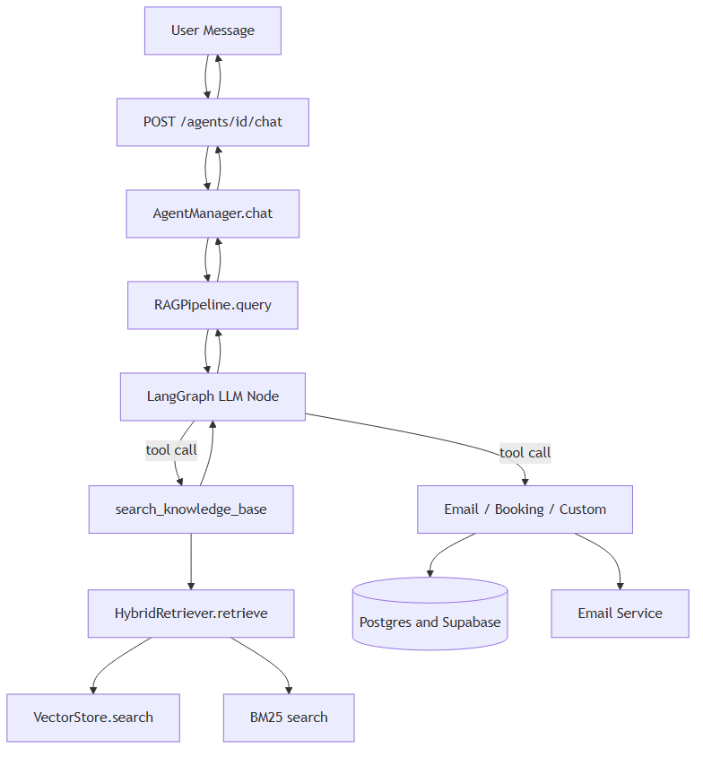
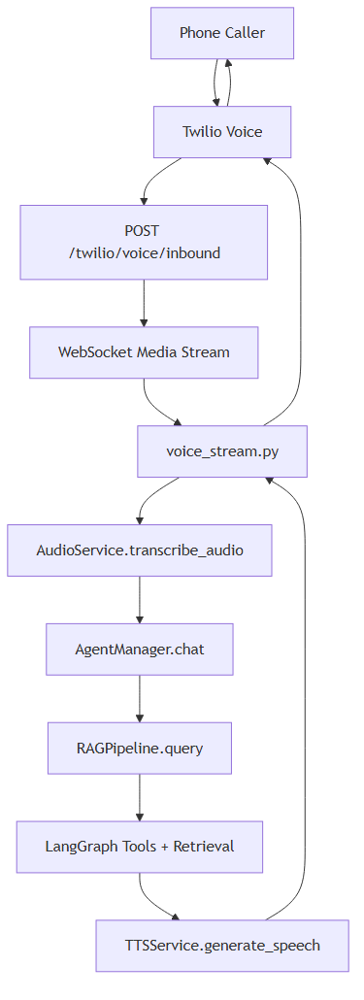
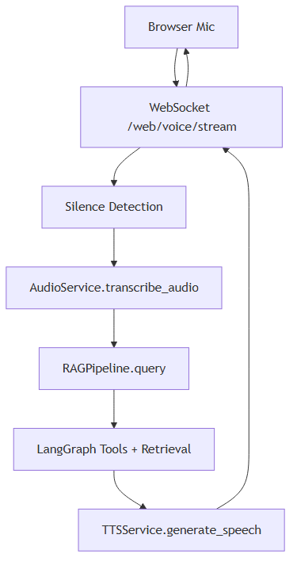
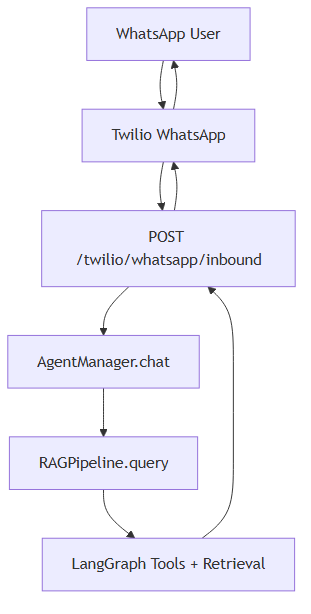

# Architecture and Workflow Orchestration

This document provides flowcharts of the system orchestration across ingestion, retrieval, generation, and multi-channel delivery.

## 1) End-to-End System Overview

## 2) Document Ingestion Flow

## 3) Query + Generation Flow (Chat)

## 4) Voice Workflow (Twilio Media Streams)

## 5) Web Browser Realtime Voice Workflow

## 6) WhatsApp Workflow

---

If you want a more detailed diagram (e.g., database tables, message lifecycle, or error paths), tell me which layer to expand.
